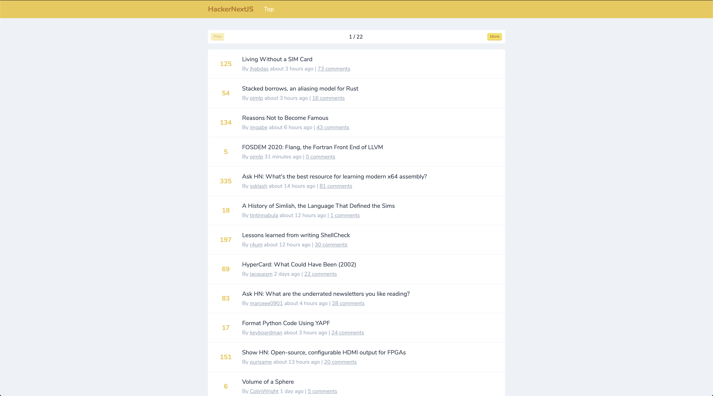

# Next-HackerNews
HackerNews clone built with NextJS



For now there is just:
- Top Stories
- Story and Comment
- User informations

Need to add soon:
- New
- Show
- Ask
- Jobs

Built with:
- [NextJS]()
- [styled-components](https://styled-components.com/)
- [date-fns](https://date-fns.org/)
- [Axios](https://github.com/axios/axios)
- [HackerNews api](https://github.com/HackerNews/API)

Feel free to give feedback about my code.

### Build setup

```bash
# install dependencies
npm install

# For dev mode
npm run dev

# To build production
npm run build
# them to serve production mode
npm run start
```